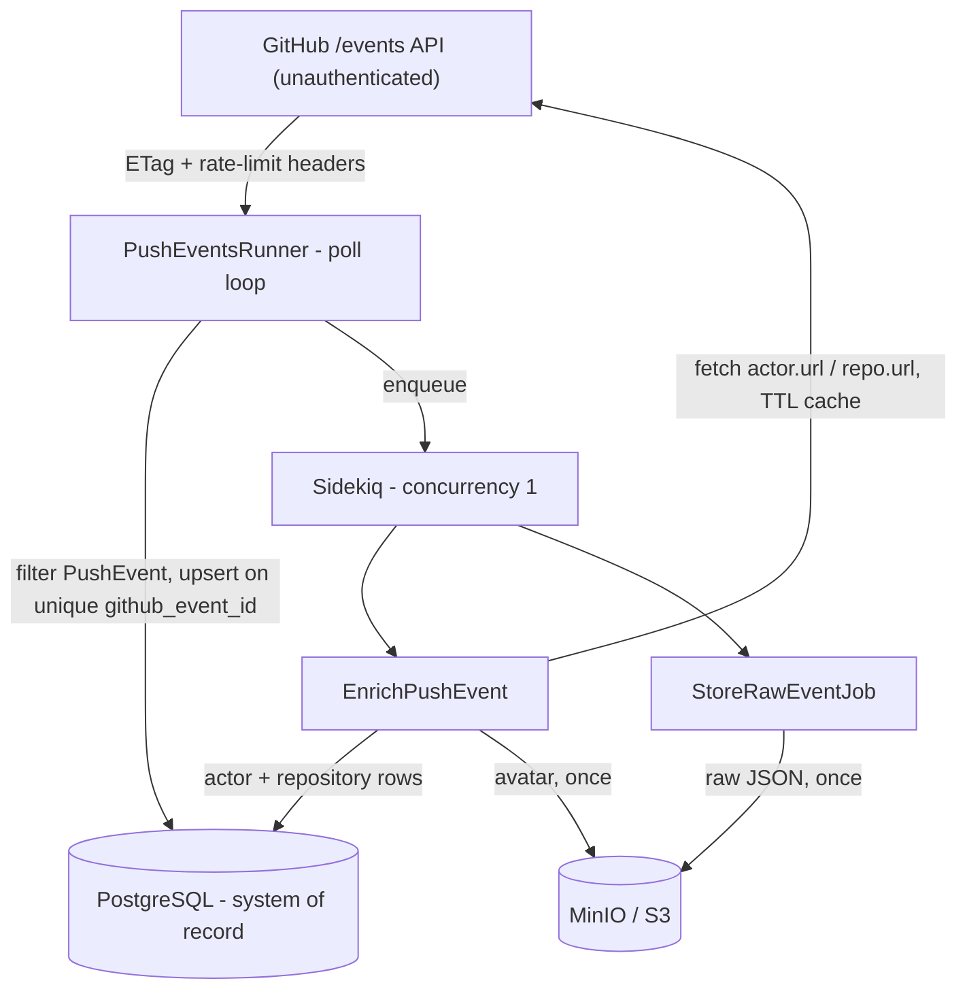

# Design Brief - GitHub Push Event Ingest

## Problem understanding

StrongMind wants better visibility into GitHub activity. This is an **unattended
internal ingest pipeline**: poll the public GitHub Events API (no auth token), keep
only `PushEvent`s, store durable raw + structured records in PostgreSQL, enrich them
with actor/repository data, and stay predictable under rate limits, duplicates, and
restarts. Success = a reviewer can `docker compose up --build`, read clear stdout
logs, query structured push rows, and re-run ingest without duplicating or
corrupting data.

## Architecture

**Stack:** Rails 8 API-only, PostgreSQL, Redis + Sidekiq, Faraday, MinIO via
`aws-sdk-s3`, Docker Compose. API-only because there is no UI - the only HTTP
surface is a `GET /up` health check - so the view/session/CSRF layers are dropped;
adding a dashboard later is additive, not a rewrite.

The poll loop (`Ingest::PushEventsRunner`) stays **thin**: filter non-`PushEvent`s
in memory, upsert one row on the unique `github_event_id`, enqueue two jobs, return.
`perform_later` only pushes to Redis - it never calls GitHub or MinIO on the hot
path. This is deliberate: GitHub's events feed is a **short sliding window**, so if
enrichment or uploads ran inline, a hung socket or MinIO outage would stall polling
and events would age out and be lost *permanently*. A backlog of un-enriched rows is
instead fully recoverable once the dependency returns. The cost is eventual
consistency - a freshly polled row is queryable immediately but may stay `pending`
until Sidekiq enriches it.

**Data model** (Postgres is the system of record; schema in
[db/schema.rb](db/schema.rb)): `push_events` holds one row per event with a unique
`github_event_id`, the Story-2 queryable columns (`repository_id`, `push_id`, `ref`,
`head`, `before`) promoted out of JSON, the full `raw_payload` for audit, and
`enrichment_status`. `actors`/`repositories` are separate caches keyed by GitHub id
with a `fetched_at` TTL - so enrichment is a **shared cache, not a copy per event**,
and repeat actors/repos cost zero extra API calls.

## Rate limits & fan-out (Extension A)

Unauthenticated GitHub REST is ~**60 requests/hour**, shared by poll + enrichment.
The scarce resource is enrichment **fan-out**, not polling: a poll is one request
(often `0` via ETag/`304`), while each new event can cost up to two enrichment
fetches. Controls:

- 60s poll / 90s idle cadence, negligible against the budget; `ETag`/`If-None-Match`
  skips unchanged bodies.
- Header-aware waits on `X-RateLimit-*` / `Retry-After` with preemptive backoff; the
  continuous worker chunks its wait with a `[ingest] waiting` countdown so it never
  looks hung.
- Enrichment is enqueued, never inline, and **Sidekiq concurrency = 1** caps
  in-flight GitHub requests to one - the queue absorbs bursts, the cap drains them
  safely.
- On rate limit mid-enrichment the job **re-enqueues after reset** instead of
  sleeping the worker; the one-shot `ingest` command logs the wait it would need and
  returns instead of hanging.

**Assumption:** without a token the goal is to demonstrate correct, honest backoff,
not maximize throughput. With a token (5,000/hour) the intervals tighten and
concurrency rises without design changes.

## Durability & reliability (Extension B, Story 4)

- Unique index on `github_event_id` makes duplicate polls no-ops; re-ingest never
  re-enqueues existing rows.
- Enrichment is idempotent: already-`enriched` events short-circuit, actor/repo
  upserts are keyed by GitHub id, and a fetch that succeeded before a rate-limit
  raise is cached for the retry. Object keys are deterministic, so existence checks
  skip re-upload/re-download.
- Cold-start `db:prepare` can race between `web` and `ingest-worker`; the entrypoint
  retries it so `docker compose up` is deterministic, not order-dependent.
- Every outbound HTTP call has bounded connect/read timeouts. Transient errors
  (`Faraday`, 5xx, storage blips wrapped as `ObjectStorage::Client::Error`) retry
  with backoff; permanent ones (malformed payloads, deleted-actor `404`s) are marked
  `failed` instead of retrying forever. The loop never crash-loops - it logs, backs
  off, and continues.
- Avatars are best-effort: a failed avatar fetch/upload still leaves the event
  `enriched`. MinIO uses the real `aws-sdk-s3` path, so production S3 is a config
  change (Extension C).
- Observability: structured stdout logs (`[ingest]`/`[enrich]`/`[storage]`/`[job]`);
  health at `GET /up`.

The theme is that **every unit of work is safe to repeat**, which is what makes the
pipeline safe to run unattended.

## Testing (Extension D)

RSpec + WebMock, GitHub stubbed so the suite is deterministic, fast, and offline.
Coverage targets the seams and failure paths: mapper, rate-limit math, both clients'
status handling (200/304/403/404), model uniqueness, idempotent ingest, cache hits,
job failure/requeue (incl. 404s), chunked backoff, upload-once storage, and the
health endpoint. Run: `docker compose run --rm --build test`.

## Key tradeoffs & assumptions

| Choice | Why |
|---|---|
| Rails API-only | Preferred stack; enough structure for jobs/models without a UI |
| Sidekiq over inline enrich | Bounds fan-out; survives restarts better than in-process threads |
| No GitHub token | Matches brief; forces honest rate-limit design |
| Dev Compose defaults (shared secrets) | Local reviewer DX only - not production hardening |
| 24h enrichment TTL | Avoids repeated fetches without pretending profiles never change |

## Intentionally not built

Each of these is a scope decision, not an oversight:

- **No AuthN/Z, multi-tenant API, or analyst UI/dashboard** - the brief asks for an
  ingest pipeline; querying is via SQL, and API-only keeps a future dashboard an
  additive change rather than a rewrite.
- **No historical backfill** - GitHub's public feed exposes only a short window, so
  backfill is impossible without a different data source; the pipeline captures
  forward from when it starts.
- **No authenticated GitHub API / higher quotas** - the brief specifies no token;
  designing against the honest ~60/hour limit is the point, and a token drops in
  without design changes.
- **No retention/compaction** (and deterministic keys overwrite rather than version)
  - rows/objects grow unbounded, which is fine for the exercise; production would add
  TTL/archival and likely `push_events` partitioning.
- **No warehouse/analytics transforms or alerting** - out of scope for an ingest
  service; downstream consumers would own that.
- **No production secrets management / deploy target** - Compose is the deliverable
  runtime; the shared dev secrets are local-DX only, not production hardening.
- **Not tested: live GitHub, multi-hour soak, UI** - these are environmental and
  non-deterministic (or nonexistent); the risks a soak would catch (leaks, retry
  storms, hung sockets) are engineered out via bounded timeouts, bounded
  transient-vs-permanent retries, and concurrency-capped fan-out.
