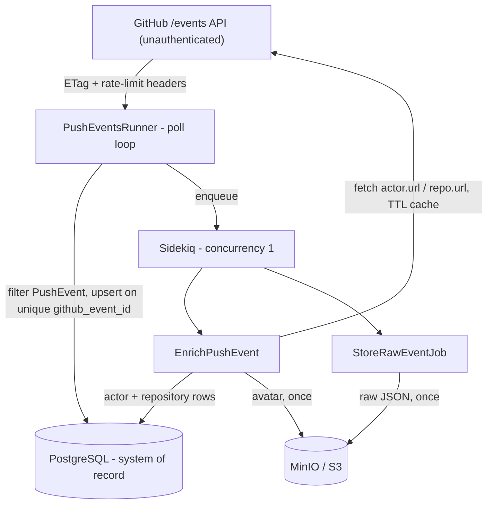

# Design Brief - GitHub Push Event Ingest

> Scaffold for the 1-2 page design brief. Each section has the substance and code
> references; expand or trim in your own voice before submitting.

## Problem understanding

StrongMind wants better visibility into GitHub activity. This is an **unattended
internal ingest pipeline**: poll the public GitHub Events API (no auth token),
keep only `PushEvent`s, store durable raw + structured records in PostgreSQL,
enrich them with actor/repository data, and stay predictable under rate limits,
duplicates, and restarts.

Success = a reviewer can `docker compose up --build`, read clear stdout logs,
query structured push rows, and re-run ingest without duplicating or corrupting
data.

## Architecture

**Stack:** Rails 8 API-only, PostgreSQL, Redis + Sidekiq, Faraday, MinIO via
`aws-sdk-s3`, Docker Compose.

**Shape / why (expand):** ingest stays thin and fast - filter, upsert, enqueue -
so a slow GitHub or MinIO call can never block polling. Enrichment and object I/O
run asynchronously on Sidekiq, where concurrency bounds fan-out.

Key code:
- Poll loop + idempotent upsert: [app/services/ingest/push_events_runner.rb](app/services/ingest/push_events_runner.rb)
- Events client (ETag, rate-limit, status handling): [app/services/github/events_client.rb](app/services/github/events_client.rb)
- Event -> columns mapping: [app/services/ingest/push_event_mapper.rb](app/services/ingest/push_event_mapper.rb)
- Enrichment service + TTL cache: [app/services/ingest/enrich_push_event.rb](app/services/ingest/enrich_push_event.rb)
- Jobs: [app/jobs/enrich_push_event_job.rb](app/jobs/enrich_push_event_job.rb), [app/jobs/store_raw_event_job.rb](app/jobs/store_raw_event_job.rb)

## Data model (Stories 1-2)

System of record is PostgreSQL. Schema: [db/schema.rb](db/schema.rb) (migration [db/migrate/20260722195448_create_ingest_tables.rb](db/migrate/20260722195448_create_ingest_tables.rb)).

- **`push_events`** - one row per GitHub event. Unique `github_event_id`. Queryable
  columns required by Story 2 (no JSON parsing): `repository_id`, `push_id`, `ref`,
  `head`, `before`. Full event in `raw_payload` (jsonb) for audit/debug; optional
  `raw_object_key` points at the MinIO copy. `enrichment_status` tracks
  `pending` / `enriched` / `failed`.
- **`actors` / `repositories`** - normalized enrichment caches keyed by GitHub id,
  with `fetched_at` for TTL freshness and `avatar_object_key` for the stored avatar.
- **FKs:** `push_events.actor_id`, `push_events.repository_record_id` (named to avoid
  clashing with GitHub's numeric `repository_id` column).

Motivation (expand): raw payload satisfies "retain for audit"; the promoted columns
satisfy "queryable without parsing"; the separate actor/repo tables make enrichment a
cache, not a copy-per-event.

## Rate limits & fan-out control (Extension A)

Unauthenticated GitHub REST is ~**60 requests/hour**, shared by poll + enrichment.
Rate-limit logic: [app/services/github/rate_limit.rb](app/services/github/rate_limit.rb).

1. Poll interval defaults to 60s; longer idle sleep on `304` / rate-limited paths.
2. `ETag` / `If-None-Match` on `/events` avoids downloading unchanged bodies.
3. Header-aware waits on `X-RateLimit-*` and `Retry-After`; preemptive backoff when
   remaining is low. The continuous worker's wait is chunked with a
   `[ingest] waiting seconds_remaining=...` countdown so it stays observable
   (never silent) even during an hour-long wait.
4. No inline enrichment during ingest - work is enqueued.
5. Sidekiq concurrency = 1 on enrichment bounds request amplification ([config/sidekiq.yml](config/sidekiq.yml)).
6. On rate limit during enrichment the job **re-enqueues after reset** instead of
   sleeping in-thread, so it can't stall the single worker ([app/services/ingest/enrich_push_event.rb](app/services/ingest/enrich_push_event.rb) `raise_if_rate_limited!`).
7. The one-shot `ingest` command runs non-blocking: it logs the wait it would need
   and returns instead of hanging for the reset window ([app/services/ingest/push_events_runner.rb](app/services/ingest/push_events_runner.rb) `backoff`).

Assumption (expand): demonstrating correct backoff matters more than maximizing
throughput without a token.

## Durability, idempotency & restart safety (Extension B)

- Unique index on `push_events.github_event_id` makes duplicate polls no-ops
  (also enforced at the model: [app/models/push_event.rb](app/models/push_event.rb)).
- Re-ingest does not re-enqueue enrichment/storage for existing rows.
- Enrichment is idempotent: already-`enriched` events short-circuit; actor/repo
  upserts are keyed by GitHub id; a fetch that already succeeded before a rate-limit
  raise is persisted and served from cache on the retry.
- Object keys are deterministic (`raw-events/{event_id}.json`,
  `avatars/{github_id}.*`); existence checks skip re-upload/re-download.
- Fresh-volume startup: `web` and `ingest-worker` both run `db:prepare`, so the
  entrypoint retries it to survive the schema-load race on a brand-new database
  ([bin/docker-entrypoint](bin/docker-entrypoint)).

Tradeoff (expand): no retention/compaction - unbounded historical growth is accepted
for this exercise; production would add TTL/archival.

## Reliability under failure (Story 4)

- **Timeouts:** every outbound HTTP call has bounded connect/read timeouts so a hung
  socket can't stall the poller or the single worker ([app/services/github/connection.rb](app/services/github/connection.rb)).
- **Retries vs. permanent failures:** transient errors (`Faraday::Error`, 5xx) retry
  with backoff; permanent ones do not - malformed payloads, unparseable bot URLs, and
  deleted actor/repo `404`s are marked `failed` instead of retrying forever
  ([app/jobs/enrich_push_event_job.rb](app/jobs/enrich_push_event_job.rb), `Github::ApiClient::NotFound`).
- **Bot accounts:** GitHub sends `actor.url` for bots with literal brackets
  (`.../github-actions[bot]`); URLs are sanitized before fetch ([app/services/ingest/enrich_push_event.rb](app/services/ingest/enrich_push_event.rb) `sanitize_url`).
- **Object-storage outages:** MinIO/S3 connectivity failures are wrapped as
  `ObjectStorage::Client::Error` and retried with backoff by the jobs, so a storage
  blip doesn't lose data or crash the worker ([app/services/object_storage/client.rb](app/services/object_storage/client.rb)).
- **Never crash-loops:** the ingest loop catches unexpected errors, logs, backs off,
  and continues; malformed events are logged and skipped.
- **Observability:** structured stdout logs (`[ingest]`, `[enrich]`, `[storage]`,
  `[job]`) via [app/services/app_log.rb](app/services/app_log.rb); health at `GET /up`.

## Object storage (Extension C)

MinIO stands in for S3 locally. Raw event JSON is uploaded asynchronously after
insert; avatars are downloaded once when `avatar_object_key` is blank. Avatar
storage is best-effort - structured enrichment still succeeds if it fails.
Code: [app/services/object_storage/](app/services/object_storage/).

## Testing strategy (Extension D)

RSpec + WebMock. Coverage: push-event mapper, rate-limit math, both GitHub clients'
status handling (200/304/403/404), model-level uniqueness, idempotent ingest,
enrichment cache hits, job failure/requeue paths (including deleted-actor 404s),
observable chunked backoff, upload-once storage, object-storage connectivity
failures, and the health endpoint. Reviewer entrypoint:
`docker compose run --rm --build test`.

Intentionally not tested (expand): live GitHub, multi-hour Compose soak, UI.

## Key tradeoffs & assumptions

| Choice | Why |
|---|---|
| Rails API-only | Preferred stack; enough structure for jobs/models without a UI |
| Sidekiq over inline enrich | Bounds fan-out; survives restarts better than in-process threads |
| No GitHub token | Matches brief; forces honest rate-limit design |
| Dev Compose defaults (shared secrets) | Local reviewer DX only - not production hardening |
| 24h enrichment TTL | Avoids repeated fetches without pretending profiles never change |

## Intentionally not built

- AuthN/Z, multi-tenant API, or analyst UI/dashboard (querying is via SQL - see README)
- Historical backfill beyond the public events window
- Authenticated GitHub API / higher quotas
- Warehouse/analytics transforms, retention policies, alerting
- Production secrets management / deploy target (Compose is the deliverable runtime)
