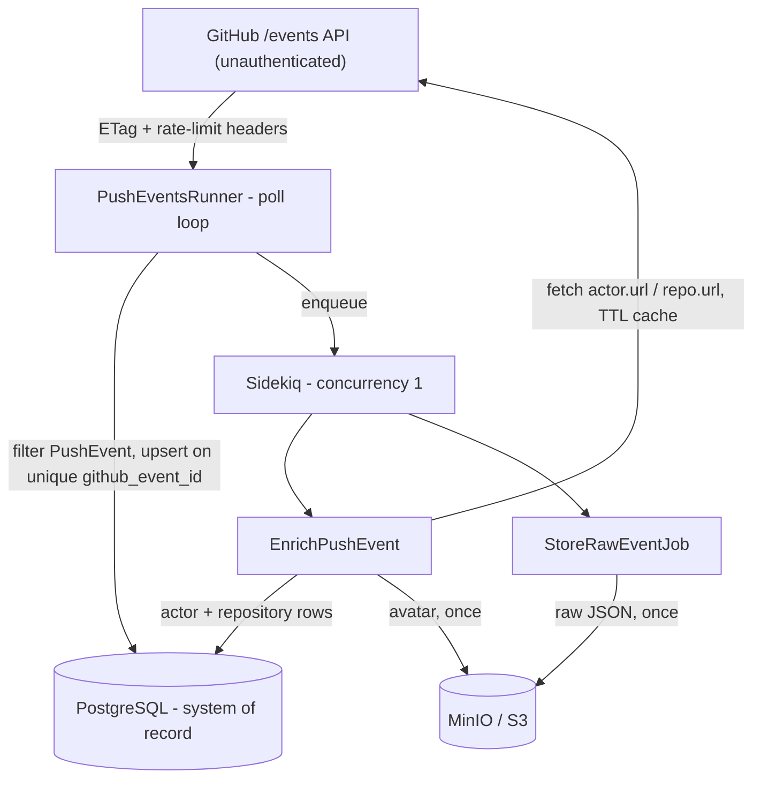

# Design Brief - GitHub Push Event Ingest

## Problem understanding

The public events feed is a **lossy, non-replayable, rate-limited firehose**: it
exposes only the last few minutes of activity, offers no history, and caps an
unauthenticated caller at ~60 requests/hour per IP. That fixes the priorities, in
order: **durability** of whatever we capture, **idempotency** across overlapping
polls and restarts, and **request economy**, since one hourly budget is shared by
polling and enrichment. Completeness is a non-goal - gaps are inherent to this source.

Concretely: poll the events API (no token), keep only `PushEvent`s, store raw +
structured records in PostgreSQL, enrich them with actor/repository data, and stay
predictable under limits, duplicates, and restarts.

## Architecture

**Stack:** Rails 8 API-only, PostgreSQL, Redis + Sidekiq, Faraday, MinIO via
`aws-sdk-s3`, Docker Compose. API-only because there is no UI - the only HTTP surface
is `GET /up` - so a future dashboard is additive, not a rewrite.

**Ingest (Story 1).** `Ingest::PushEventsRunner` polls `/events`, filters to
`PushEvent`, and upserts on unique `github_event_id`. The loop stays thin - filter,
upsert, enqueue - and never enriches or uploads inline. This is the central decision:
the feed is a short sliding window, so if slow work ran inline a hung socket would
stall polling and events would age out permanently. A backlog of un-enriched rows is
recoverable; a missed window is not. Decoupling is not parallelism, though: concurrent
enrichment against one shared budget only causes contention, so Sidekiq runs at
**concurrency 1**. The queue buys restart safety and window protection, not throughput
this workload can't use.

**Persistence (Story 2).** Postgres is the system of record. `raw_payload` jsonb (+ an
optional MinIO copy) retains the original for audit; promoted columns `repository_id`,
`push_id`, `ref`, `head`, `before` satisfy "queryable without JSON parsing";
`actors`/`repositories` are caches keyed by GitHub id so enrichment is shared, not
copied per row. `enrichment_status` (`pending`/`enriched`/`failed`) makes progress and
failures queryable.

**Enrichment (Story 3).** Runs asynchronously using `actor.url`/`repository.url` from
the payload, with a 24h `fetched_at` TTL - a cache hit is zero GitHub calls. Eventual
consistency is accepted: a freshly polled row is queryable immediately but may stay
`pending` until Sidekiq finishes.

**Operability (Story 4).** Structured stdout logs (`[ingest]`/`[enrich]`/`[storage]`)
cover polls, successes, failures, and retries. Malformed events are logged and skipped;
the loop catches unexpected errors, backs off, and never crash-loops. Transient
failures (Faraday, 5xx, 429) retry with jittered backoff; permanent ones (bad payloads,
deleted-actor 404s) mark `failed` instead of retrying forever. Bounded HTTP timeouts
stop a hung socket from stalling the poller or the single worker.

## Rate limits & durability

**Rate limits (Extension A).** The scarce resource is enrichment fan-out (up to two
fetches per new event), not polling (one request, often a cheap `304` via ETag).
Controls: header-aware `X-RateLimit`/`Retry-After` waits with a chunked countdown so a
long wait never looks hung; concurrency 1; and rate-limited enrichment jobs
**re-enqueue after reset** instead of sleeping the worker. A token (5,000/hour) would
tighten intervals with no redesign.

**Idempotency & restarts (Extension B).** Unique `github_event_id` makes duplicate
polls no-ops; enrichment short-circuits when already `enriched`; actor/repo upserts
keyed by GitHub id mean a fetch that succeeded before a rate-limit raise is cached on
retry. There is no checkpoint state to corrupt - killing the runner mid-cycle
re-processes at most one page, all no-ops. Every unit of work is safe to repeat.

**Object storage (Extension C).** MinIO stands in for S3 (production S3 is a config
change). Raw JSON uploads asynchronously after insert (`raw-events/{id}.json`); avatars
upload once and are best-effort, so a failed avatar never fails enrichment.
Deterministic keys plus existence checks skip re-upload.

## Security

This service takes input from an external feed and makes outbound requests on its
behalf, so a few surfaces are worth naming:

- **SSRF (the sharpest).** Enrichment fetches absolute URLs taken from the payload;
  today they originate from `api.github.com` and are sanitized only for URL validity.
  The next control is a **host allowlist** before any fetch. Two mitigations already
  hold: Faraday follows no redirects, and every request is timeout-bounded, so a
  hostile host cannot pivot or hang the worker.
- **No outbound token by design** - there is no credential to leak or over-scope; the
  cost is the 60/hour budget, taken knowingly.
- **Log injection** - every logged value is `inspect`-quoted (`AppLog.sanitize`), so a
  crafted repo name or `ref` cannot forge `key=value` pairs or inject newlines.
- **Secrets & image** - the Compose secrets and the root, dev-gem image are reviewer
  conveniences; production uses a secrets manager and a non-root, multi-stage build.

## Key tradeoffs & what I did not build

| Choice | Why |
|---|---|
| Sidekiq over inline enrich | Protects the feed window; survives restarts |
| Concurrency 1 | No contention on one shared budget |
| No GitHub token | Matches the brief; forces honest rate-limit design |
| 24h enrichment TTL | Avoids repeated fetches without pretending profiles never change |

Intentionally out of scope, each a decision and not an oversight: no auth or UI
(querying is SQL; a dashboard stays additive), no historical backfill (the feed has no
history), no retention/compaction (unbounded growth is fine for the exercise;
production would add TTL + partitioning), and no metrics backend (plain stdout suits
`docker compose logs`; production would add JSON logs, OpenTelemetry, and alerting on
enrichment-failure rate). Testing (Extension D) is hermetic and offline - WebMock
blocks all outbound HTTP - and the README's requirements-traceability table maps each
acceptance criterion to the spec that proves it.
