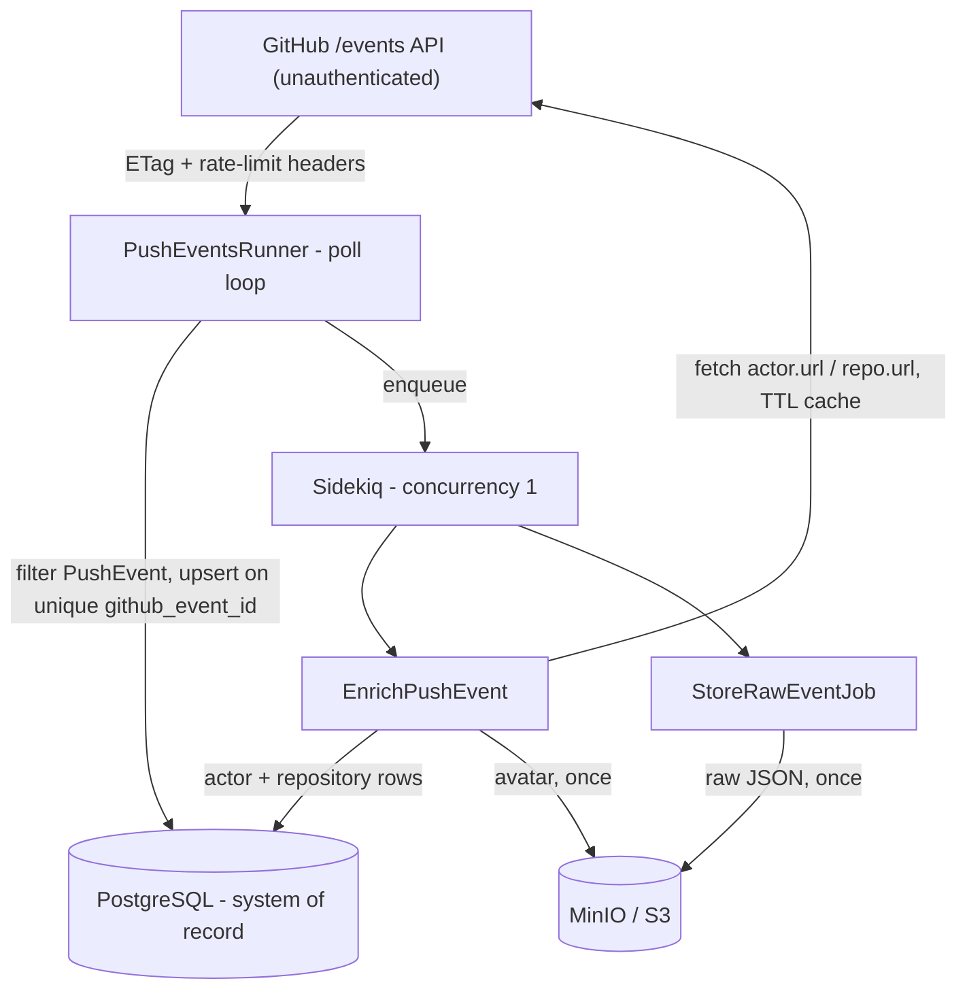

# Design Brief - GitHub Push Event Ingest

## Problem understanding

StrongMind wants better visibility into GitHub activity. This is an **unattended
internal ingest pipeline**: poll the public GitHub Events API (no auth token), keep
only `PushEvent`s, store durable raw + structured records in PostgreSQL, enrich them
with actor/repository data, and stay predictable under rate limits, duplicates, and
restarts. Success = a reviewer can `docker compose up --build`, read clear stdout
logs, query structured push rows, and re-run ingest without duplicating or
corrupting data.

## Architecture

**Stack:** Rails 8 API-only, PostgreSQL, Redis + Sidekiq, Faraday, MinIO via
`aws-sdk-s3`, Docker Compose. API-only because there is no UI - the only HTTP
surface is `GET /up` - so view/session/CSRF layers are dropped; a future dashboard
is additive, not a rewrite.

### Story 1 - Ingest PushEvents

`Ingest::PushEventsRunner` polls `/events`, filters to `PushEvent` only, and upserts
on unique `github_event_id`. Continuous mode (`ingest-worker`) loops with
rate-limit-aware sleeps; one-shot mode (`docker compose run --rm ingest`) runs a
single poll and returns immediately on rate-limit waits so reviewers never hang.
The loop stays **thin** - filter, upsert, enqueue - and never calls enrichment or
MinIO inline. GitHub's feed is a **short sliding window**: if slow work ran inline,
a hung socket would stall polling and events would age out and be lost permanently.
A backlog of un-enriched rows is recoverable; missed window events are not.

### Story 2 - Raw + structured persistence

Postgres is the system of record ([db/schema.rb](db/schema.rb)). Three concerns stay
separate: (1) `raw_payload` jsonb (+ optional MinIO copy) retains the original for
audit/re-derivation after the events window rolls over; (2) promoted columns
`repository_id`, `push_id`, `ref`, `head`, `before` satisfy "queryable without JSON
parsing"; (3) `actors`/`repositories` are normalized caches keyed by GitHub id so
enrichment is shared across events, not copied per row. `enrichment_status`
(`pending`/`enriched`/`failed`) makes progress and failures queryable.

### Story 3 - Enrichment

Enrichment runs asynchronously (`EnrichPushEventJob`) using `actor.url` /
`repository.url` from the event payload (sanitized for bot URLs that contain
literal brackets). Results land in `actors`/`repositories` with a 24h `fetched_at`
TTL - a cache hit is zero GitHub calls, which is how we "avoid obviously
unnecessary repeated fetches" without pretending profiles never change. The event
row then links via FKs. Eventual consistency is accepted: a freshly polled row is
queryable immediately but may stay `pending` until Sidekiq finishes.

### Story 4 - Operability

Structured stdout logs (`[ingest]`/`[enrich]`/`[storage]`/`[job]`) cover poll
behavior, successes, failures, and retries; health at `GET /up`. Malformed events
are logged and skipped; the poll loop catches unexpected errors, backs off, and
continues - never crash-loops. Transient failures (`Faraday`, 5xx) retry with
backoff; permanent ones (bad payloads, deleted-actor `404`s) mark `failed` instead
of retrying forever. Bounded HTTP timeouts keep hung sockets from stalling the
poller or the single Sidekiq worker.

## Rate limits & fan-out (Extension A)

Unauthenticated GitHub is ~**60 req/hour**, shared by poll + enrichment. The scarce
resource is enrichment **fan-out** (up to two fetches per new event), not polling
(one request, often a cheap `304` via ETag that skips the body; unauthenticated
`304`s still count against the ~60/hour quota). Controls: 60s/90s poll/idle cadence; header-aware
`X-RateLimit-*`/`Retry-After` waits with a chunked `[ingest] waiting` countdown;
Sidekiq concurrency = 1 so at most one in-flight enrichment request; rate-limited
enrichment jobs **re-enqueue after reset** instead of sleeping the worker. Without
a token the goal is honest backoff, not max throughput; a token (5,000/hour)
tightens intervals without design changes.

## Idempotency & restart safety (Extension B)

Unique `github_event_id` makes duplicate polls no-ops; re-ingest never re-enqueues
existing rows. Enrichment short-circuits when already `enriched`; actor/repo upserts
are keyed by GitHub id so a fetch that succeeded before a rate-limit raise is
cached on retry. Cold-start `db:prepare` can race between `web` and `ingest-worker`;
the entrypoint retries it so `docker compose up` is deterministic. Theme: **every
unit of work is safe to repeat**, which is what makes unattended operation safe.
Tradeoff: no retention/compaction - growth is unbounded for this exercise;
production would add TTL/archival.

## Object storage (Extension C)

MinIO stands in for S3 via `aws-sdk-s3` (production S3 is a config change). Raw
JSON uploads asynchronously (`StoreRawEventJob`) keyed `raw-events/{event_id}.json`
after insert - off the hot path, retried independently. Avatars upload once when
`avatar_object_key` is blank (`avatars/{github_id}.*`) and are **best-effort**: a
failed avatar must not fail structured enrichment. Deterministic keys + existence
checks skip re-upload; storage connectivity errors wrap as
`ObjectStorage::Client::Error` so job retry policies apply uniformly.

## Testing (Extension D)

RSpec + WebMock stubs GitHub so tests are deterministic, fast, and offline -
matching where risk lives (status handling, rate-limit math, idempotency, failure
classification), not framework glue. Coverage: mapper, rate-limit math, clients
(200/304/403/404), uniqueness, idempotent ingest, cache hits, job failure/requeue
(incl. 404s), chunked backoff, upload-once storage, health. Run:
`docker compose run --rm --build test`. Not tested: live GitHub, multi-hour soak,
UI - environmental/non-deterministic; soak risks (leaks, retry storms, hung
sockets) are engineered out via timeouts, bounded retries, and concurrency caps.

## Key tradeoffs & assumptions

| Choice | Why |
|---|---|
| Rails API-only | Preferred stack; jobs/models without a UI |
| Sidekiq over inline enrich | Bounds fan-out; survives restarts |
| No GitHub token | Matches brief; forces honest rate-limit design |
| Dev Compose defaults | Reviewer DX only - not production hardening |
| 24h enrichment TTL | Avoids repeated fetches without pretending profiles never change |

## Intentionally not built

Each is a scope decision, not an oversight:

- **No AuthN/Z, multi-tenant API, or analyst UI** - brief asks for ingest; querying
  is via SQL; API-only keeps a dashboard additive.
- **No historical backfill** - public feed is a short window; backfill needs a
  different source; we capture forward from start.
- **No authenticated GitHub API** - no-token is the point; a token drops in without
  redesign.
- **No retention/compaction** - unbounded growth OK for the exercise; production
  would add TTL/archival (+ likely partitioning).
- **No warehouse transforms or alerting** - ingest owns capture; consumers own
  analytics.
- **No production secrets/deploy target** - Compose is the deliverable runtime.
