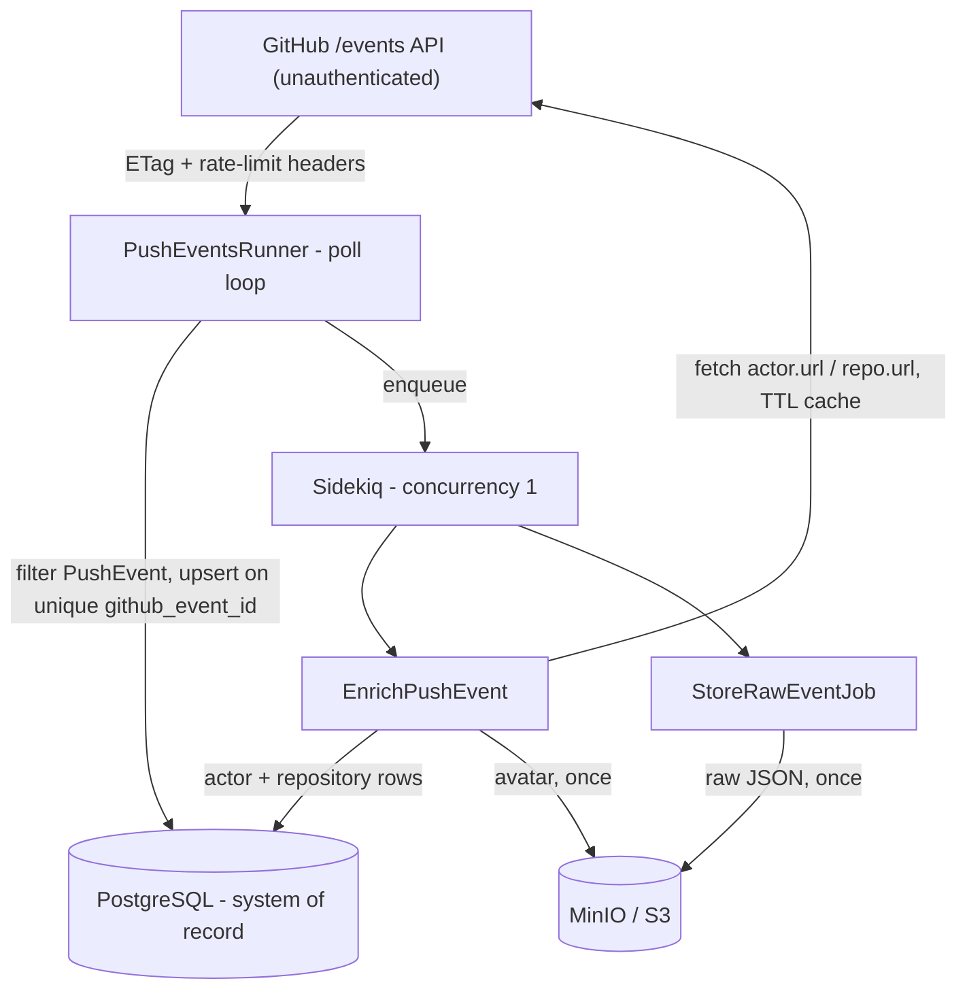

# Design Brief - GitHub Push Event Ingest

## How I framed the problem

The business ask is visibility into GitHub push activity for later analysis - an
**unattended internal pipeline**, not a product UI. The technical constraint that
shapes everything else is the data source: the public events feed is a **lossy,
non-replayable, rate-limited firehose**. It exposes only a short sliding window of
activity, offers no historical backfill, and caps an unauthenticated caller at
~60 requests/hour per IP, shared by polling and enrichment.

That framing sets priorities, in order:

1. **Capture what we can before it disappears** - durability of whatever we see.
2. **Never corrupt or double-count under overlap/restarts** - idempotency.
3. **Spend the shared budget on enrichment, not waste** - request economy.

Completeness is a non-goal: gaps are inherent to this source. Throughput without a
token is also a non-goal - the brief asks for predictable behavior under limits, not
max events ingested.

## How I broke it into stories

I treated the four core stories as a **capture → store → enrich → operate** pipeline
because that matches the failure boundary of the feed:

| Story | Decision it forces |
|---|---|
| **1 Ingest** | Stay on the hot path only long enough to persist identity. Anything slower risks missing the window. |
| **2 Persist** | Make analyst queries cheap *and* keep the original event - the window will roll over, so re-derivation needs a local copy. |
| **3 Enrich** | Spend scarce GitHub calls *off* the poll path, and only when the cache can't answer. |
| **4 Operate** | An unattended service that goes silent or crash-loops under rate limits fails the business ask even if the schema is perfect. |

Extensions A–D weren't bolted on afterward - they are how Stories 1–4 stay honest
under the firehose constraints (budget, duplicates, durable blobs, offline proof).

## Architecture

**Why Rails API-only + Compose.** Preferred stack; no human UI, so views/sessions/
CSRF are dead weight. The only HTTP surface is `GET /up`. A future dashboard is
additive. Compose is the deliverable runtime because the brief requires a one-command
macOS review, not a production deploy story.

**Why the poll loop is thin (filter → upsert → enqueue).** This is the central
design choice. If enrichment or MinIO ran inline, a hung socket stalls polling and
events age out of the window **permanently**. A backlog of `pending` rows is
recoverable once the dependency returns. I deliberately trade eventual consistency
(rows queryable before enrichment finishes) for window protection.

**Why Sidekiq concurrency = 1.** Decoupling is for restart safety and window
protection, **not** throughput. Concurrent enrichment against one shared ~60/hour
budget only amplifies contention. The queue absorbs bursts; the cap drains them at a
quota-safe rate.

**Why three persistence shapes, not one blob.** Raw `jsonb` (+ optional object
copy) exists because the feed can't be re-fetched later. Promoted columns exist so
analysts don't parse JSON for Story 2's fields. Separate `actors`/`repositories`
exist so enrichment is a **shared TTL cache**, not a copy-per-event - which is what
makes fan-out control actually pay off.

**Why transient ≠ permanent failures.** Unattended means retries must terminate.
Network/5xx/rate-limit paths retry or re-enqueue; malformed payloads and deleted-
actor `404`s mark `failed` and stop. Bounded HTTP timeouts keep a hung socket from
owning the single worker. Structured stdout (`[ingest]`/`[enrich]`/`[storage]`/
`[job]`) exists so `docker compose logs -f` answers "what is it doing?" without a
metrics stack.

## Rate limits & durability

**Rate limits.** The scarce resource is enrichment fan-out (up to two fetches per
new event), not polling. Polling uses ETag/`304` to skip bodies; under no-token,
those `304`s still count against quota, so the real savings are bandwidth and
avoiding needless processing - not "free" polls. Header-aware waits, a chunked
`[ingest] waiting` countdown (so a long wait never looks hung), concurrency 1, and
**re-enqueue-on-rate-limit** (instead of sleeping the worker) keep the single Sidekiq
thread free for cheap storage jobs. Assumption: demonstrate honest backoff; a token
(5,000/hour) would tighten intervals without redesign.

**Durability / idempotency.** Unique `github_event_id` makes overlapping polls and
restarts converge rather than duplicate. Enrichment short-circuits when already
`enriched`; actor/repo upserts keyed by GitHub id mean a fetch that succeeded before
a rate-limit raise is not wasted on retry. Deterministic object keys + existence
checks skip re-upload. There is no fragile checkpoint cursor - killing the runner
mid-cycle re-reads at most one page, all no-ops. Theme: **every unit of work is safe
to repeat**, which is the only reliable posture for an unattended process.

**Object storage.** Chosen to practice the real S3 shape locally (MinIO via
`aws-sdk-s3` - production is config). Async raw upload keeps MinIO off the poll
path. Avatars are best-effort so a decoration failure never fails the record it
decorates. Bounding *re-work* (upload-once) was in scope; bounding *retention* was
not - see below.

## Key tradeoffs & assumptions

| Choice | Why |
|---|---|
| Thin poll + async enrich | Protects the sliding window over enrichment latency |
| Sidekiq concurrency 1 | One shared budget; parallelism would burn it |
| No GitHub token | Matches the brief; forces honest rate-limit design |
| 24h enrichment TTL | Avoids wasteful refetches without pretending profiles are frozen |
| Eventual enrichment | Recoverable lag beats permanent missed events |
| Dev Compose secrets | Reviewer DX only - not production hardening |

## What I intentionally did not build

Each cut follows from the framing above, not from running out of time:

- **No UI / AuthN/Z** - the ask is an ingest pipeline; analysts query SQL; API-only
  keeps a dashboard additive.
- **No historical backfill** - the feed has no history; inventing another source
  would change the problem.
- **No retention/compaction** - unbounded growth is acceptable for the exercise;
  production would add TTL/archival and likely partitioning. Ext C demonstrates
  upload-once durability, not lifecycle policy.
- **No authenticated GitHub API** - designing against ~60/hour *is* the challenge;
  a token drops in without redesign.
- **No metrics/alerting backend** - stdout satisfies the Compose reviewer loop;
  production would add structured JSON + OpenTelemetry + alerts on enrichment-failure
  rate.
- **No live-GitHub / multi-hour soak in CI** - flaky and quota-dependent; the suite
  stubs seams with WebMock. Soak risks (hung sockets, retry storms) are engineered
  out via timeouts, bounded retries, and concurrency caps.

## Security

Enrichment fetches absolute URLs from the payload, so **SSRF** is the sharpest next
control (host allowlist). Today: Faraday follows no redirects, requests are
timeout-bounded, and logged values are `inspect`-quoted to blunt log injection. No
outbound token by design - nothing to leak; the cost is the budget, taken knowingly.
Compose secrets and a root/dev image are reviewer conveniences, not a production
posture.
